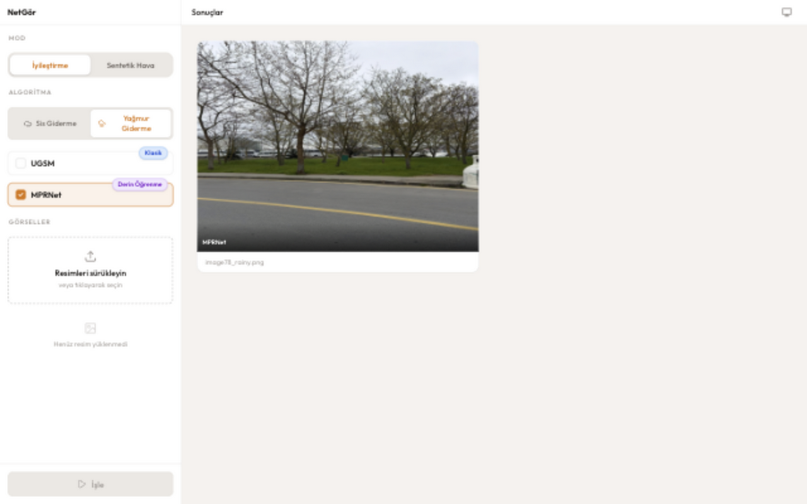
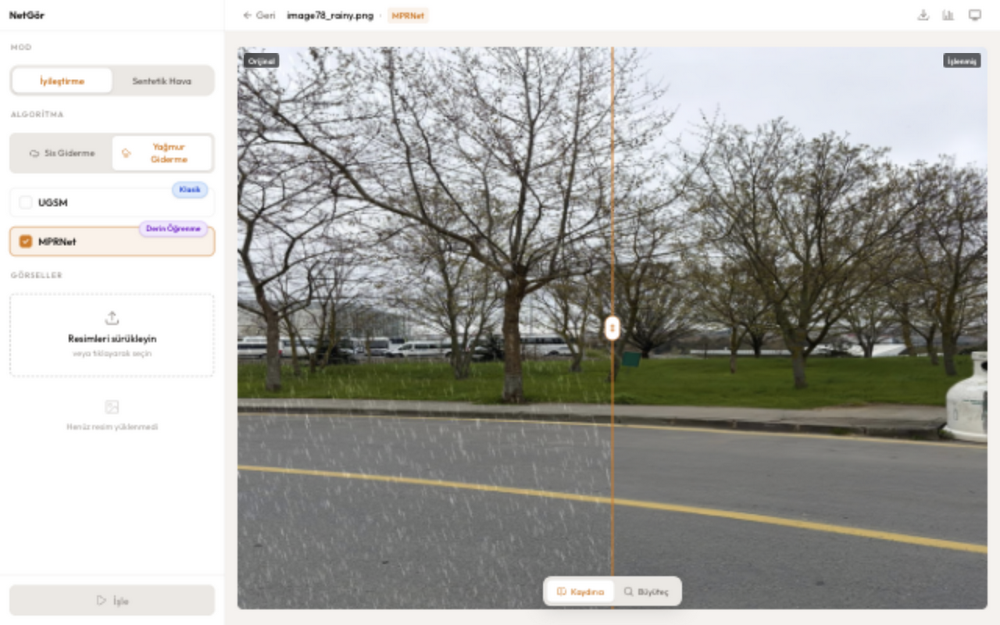
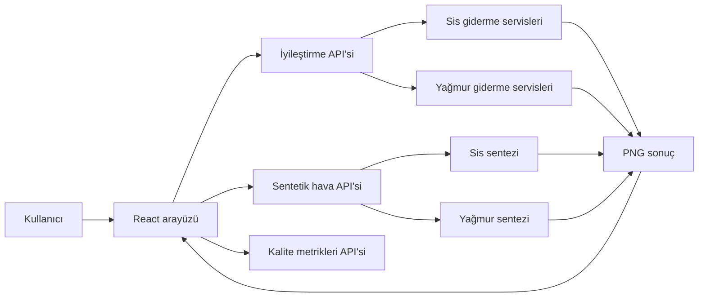

# NetGör

NetGör, sisli ve yağmurlu görüntüleri iyileştirmek, farklı algoritmaların çıktılarını karşılaştırmak ve kontrollü sentetik hava koşulları üretmek için geliştirilmiş web tabanlı bir görüntü işleme uygulamasıdır.

Uygulama, klasik görüntü işleme yöntemleriyle derin öğrenme modellerini aynı arayüzde toplar. Birden fazla görseli ve algoritmayı birlikte çalıştırabilir; sonuçları kaydırıcı veya büyüteç ile inceleyebilir ve görüntü kalite metrikleriyle değerlendirebilirsiniz.

## Arayüz

Ekran görüntülerinde gerçek bir yağmurlu PNG ve bu görselin MPRNet ile işlenmiş çıktısı kullanılmıştır.

### Sonuç galerisi

İşlenen görseller algoritma ve işlem zincirine göre gruplandırılır.



### Önce/sonra karşılaştırması

Kaydırıcı görünümü, orijinal ve işlenmiş görüntüyü aynı kadraj üzerinde karşılaştırır. Ayrıntılı inceleme için büyüteç modu da kullanılabilir.



## Özellikler

- Sis giderme: Hızlı Tek Görüntü Sis Giderme ve DehazeFormer
- Yağmur giderme: UGSM ve MPRNet
- Aynı görsel üzerinde birden fazla algoritmayı toplu çalıştırma
- Birden fazla görseli tek işlem kuyruğunda işleme
- Ayarlanabilir yoğunlukta sentetik sis ve yağmur üretme
- Sentetik hava çıktısını uygun iyileştirme algoritmasına aktarabilen işlem zinciri
- Kaydırıcı, büyüteç ve çoklu sonuç karşılaştırma görünümleri
- Referans gerektirmeyen Entropi, NIQE, BRISQUE, PIQE ve FADE metrikleri
- Temiz referans görüntüyle MSE, PSNR ve SSIM hesaplama
- İşlenmiş PNG çıktısını indirme
- Açık, koyu ve sistem temaları

## Desteklenen yöntemler

| Görev           | Yöntem                                       | Tür           |
| --------------- | -------------------------------------------- | ------------- |
| Sis giderme     | Hızlı Tek Görüntü Sis Giderme                | Klasik        |
| Sis giderme     | DehazeFormer                                 | Derin öğrenme |
| Yağmur giderme  | UGSM                                         | Klasik        |
| Yağmur giderme  | MPRNet                                       | Derin öğrenme |
| Sentetik sis    | Depth Anything V2 tabanlı derinlik kestirimi | Derin öğrenme |
| Sentetik yağmur | Prosedürel yağmur sentezi                    | Klasik        |

## Nasıl çalışır?



Tipik kullanım akışı:

1. JPG, PNG, WebP veya BMP biçiminde, en fazla 20 MB boyutunda bir ya da daha fazla görsel yükleyin.
2. **İyileştirme** modunda görev türünü ve çalıştırılacak algoritmaları seçin.
3. **İşle** düğmesine basın; sonuçlar ana alanda işlem grupları halinde gösterilir.
4. Bir sonucu açarak kaydırıcı veya büyüteç görünümünde inceleyin.
5. İsterseniz kalite metriklerini hesaplayın, temiz referans yükleyin veya sonucu indirin.

Sentetik veri üretmek için **Sentetik Hava** moduna geçin, sis ya da yağmuru seçin, yoğunluğu ayarlayın ve uygulanacak görselleri işaretleyin. Üretilen sentetik sonuç daha sonra uygun sis/yağmur giderme algoritmalarıyla yeniden işlenebilir.

## Teknoloji yığını

| Katman                | Teknolojiler                                                        |
| --------------------- | ------------------------------------------------------------------- |
| Frontend              | React 19, TypeScript, TanStack Start/Router, Vite 7, Tailwind CSS 4 |
| Backend               | Python 3.12, FastAPI, OpenCV, NumPy, SciPy, scikit-image            |
| Modeller ve metrikler | PyTorch, Torchvision, pyiqa, FADE                                   |
| Çalıştırma            | Docker Compose, uv, npm                                             |

## Proje yapısı

```text
clearview/
├── backend/
│   ├── app/
│   │   ├── routers/       # Sağlık, işleme, sentetik hava ve metrik uçları
│   │   └── services/      # Algoritma ve metrik uygulamaları
│   ├── models/            # Depoda tutulan yardımcı model/veri dosyaları
│   └── tests/             # Pytest API ve servis testleri
├── frontend/
│   ├── public/
│   └── src/
│       ├── components/    # Yükleme, seçim ve karşılaştırma bileşenleri
│       ├── hooks/         # Uygulama durumu
│       ├── lib/           # API istemcisi ve indirme yardımcıları
│       └── routes/        # TanStack Router sayfaları
├── docs/images/           # README ekran görüntüleri
├── .env.example           # Docker için model yolu şablonu
└── docker-compose.yml
```

## Hızlı başlangıç: Docker Compose

### Gereksinimler

- Docker ve Docker Compose
- Aşağıdaki harici model depoları ve ağırlık dosyaları

Docker yapılandırması dört host yolunu zorunlu olarak bekler. Önce ortam dosyasını oluşturun:

```bash
cp .env.example .env
```

Ardından `.env` içindeki yolları kendi makinenize göre düzenleyin:

| Değişken                | Beklenen konum                                                         |
| ----------------------- | ---------------------------------------------------------------------- |
| `DEPTH_ANYTHING_REPO`   | Depth-Anything-V2 deposunun kök dizini                                 |
| `FOG_MAKER_CHECKPOINTS` | `depth_anything_v2_vitl.pth` dosyasını içeren dizin                    |
| `DEHAZEFORMER_REPO`     | `save_models/indoor/dehazeformer-w.pth` içeren DehazeFormer deposu     |
| `MPRNET_REPO`           | `Deraining/pretrained_models/model_deraining.pth` içeren MPRNet deposu |

Servisleri derleyip başlatın:

```bash
docker compose up --build
```

- Arayüz: <http://localhost:3000>
- Backend API: <http://localhost:8000>
- OpenAPI arayüzü: <http://localhost:8000/docs>
- Sağlık kontrolü: <http://localhost:8000/health>

Servisleri durdurmak için:

```bash
docker compose down
```

## Yerel geliştirme

### Frontend

Vite 7 için Node.js `20.19+` veya `22.12+` gerekir.

```bash
cd frontend
npm ci
npm run dev
```

Frontend varsayılan olarak API isteklerini `http://localhost:8000` adresine gönderir. Farklı bir adres için geliştirme sunucusunu şu değişkenle başlatabilirsiniz:

```bash
VITE_API_URL=http://localhost:8000 npm run dev
```

> [!NOTE]
> `/api/process` erişilemezse frontend geliştirme kolaylığı için mevcut görseli gecikmeli bir mock sonuç olarak gösterir. Bu yalnızca arayüz akışını doğrular; gerçek bir model çıktısı değildir. Sentetik hava ve metrik özellikleri çalışan backend gerektirir.

### Backend

Python 3.12 ve `uv` gerekir. Docker dışında çalışırken harici model yollarını doğrudan backend değişkenleriyle verin:

```bash
cd backend

export NETGOR_DEPTH_ANYTHING_REPO=/path/to/Depth-Anything-V2
export NETGOR_FOG_WEIGHTS_PATH=/path/to/depth_anything_v2_vitl.pth
export NETGOR_DEHAZEFORMER_REPOSITORY=/path/to/DehazeFormer
export NETGOR_DEHAZEFORMER_WEIGHTS_PATH=/path/to/DehazeFormer/save_models/indoor/dehazeformer-w.pth
export NETGOR_MPRNET_REPOSITORY=/path/to/MPRNet/Deraining
export NETGOR_MPRNET_CHECKPOINT=/path/to/MPRNet/Deraining/pretrained_models/model_deraining.pth

uv sync --frozen
uv run fastapi dev app/main.py --host 0.0.0.0
```

DehazeFormer ve MPRNet çıkarımında en uzun kenar varsayılan olarak 1024 piksele sınırlandırılır. Gerektiğinde `NETGOR_DEHAZEFORMER_MAX_SIDE` ve `NETGOR_MPRNET_MAX_SIDE` değişkenleriyle bu değerleri değiştirebilirsiniz. Cihaz seçimi CUDA, Apple MPS ve CPU sırasıyla otomatik yapılır.

## API özeti

| Yöntem | Uç                            | Açıklama                                                                    |
| ------ | ----------------------------- | --------------------------------------------------------------------------- |
| `GET`  | `/health`                     | Servis sağlık durumunu döndürür.                                            |
| `GET`  | `/api/capabilities`           | Sentetik sis ve yağmur özelliklerinin kullanılabilirliğini bildirir.        |
| `POST` | `/api/process`                | `image` ve `algorithm` alanlarını alıp iyileştirilmiş PNG döndürür.         |
| `POST` | `/api/synthesize/weather`     | `image`, `effect` ve `intensity` alanlarıyla sentetik hava üretir.          |
| `POST` | `/api/metrics/no-reference`   | `image` ve isteğe bağlı `include_fade` ile referanssız metrikleri hesaplar. |
| `POST` | `/api/metrics/full-reference` | `reference` ve `output` görselleriyle MSE, PSNR ve SSIM hesaplar.           |

`/api/process` için geçerli algoritma kimlikleri:

```text
fast-single-image-dehazing
dehazeformer
ugsm
mprnet
```

## Test ve kalite kontrolleri

Backend testleri:

```bash
cd backend
uv run pytest
```

Frontend testleri ve statik kontroller:

```bash
cd frontend
npm run test
npm run lint
npm run format
npm run build
```

## Sorun giderme

- `docker compose` bir değişkenin ayarlanmadığını söylüyorsa `.env` dosyasındaki dört model yolunun da dolu ve host üzerinde erişilebilir olduğundan emin olun.
- Sentetik sis seçeneği kapalıysa `/api/capabilities` yanıtındaki `fog.reason` alanını ve Depth Anything V2 yollarını kontrol edin.
- DehazeFormer veya MPRNet isteği `503` döndürüyorsa depo yapısının ve checkpoint dosyasının yukarıdaki yollarla eşleştiğini doğrulayın.
- Frontend API'ye bağlanamıyorsa backend'in `8000`, frontend'in `3000` portunda çalıştığını ve `VITE_API_URL` değerini kontrol edin.
- İlk model çağrısı, ağırlıkların belleğe yüklenmesi nedeniyle sonraki çağrılardan daha uzun sürebilir.
