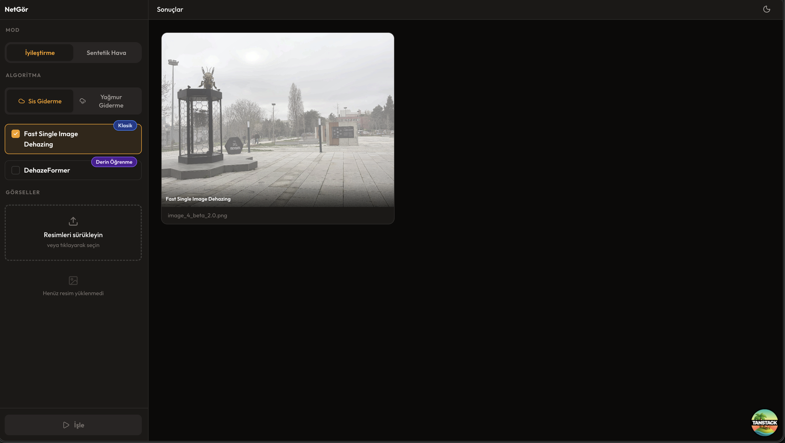
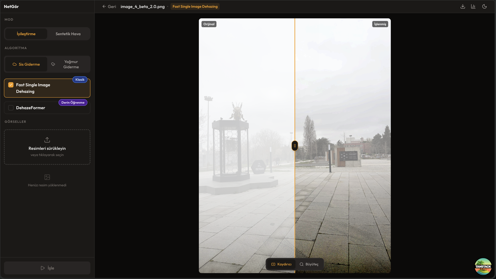
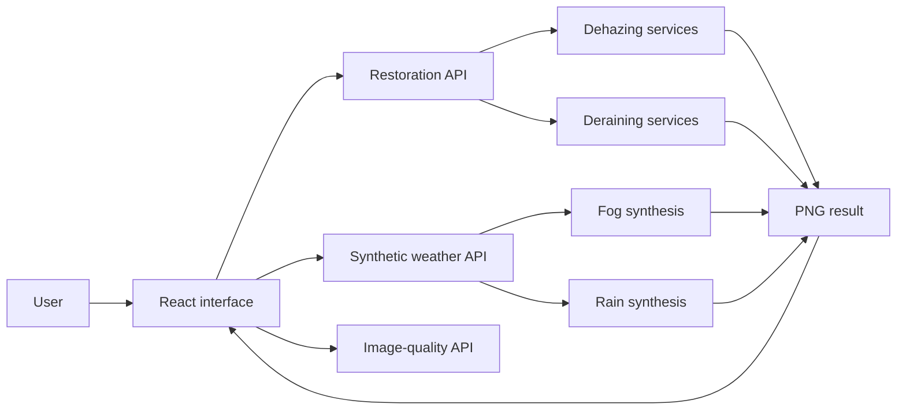

# ClearView

ClearView is a web-based image-processing application for restoring images degraded by fog or rain, comparing the output of multiple algorithms, and generating controlled synthetic weather conditions.

The application brings classical image-processing techniques and deep-learning models into one interface. It can process multiple images with multiple algorithms, present the results through slider or magnifier comparisons, and evaluate image quality with both full-reference and no-reference metrics.

### Result gallery

Processed images are grouped by algorithm and processing pipeline.



### Before-and-after comparison

The slider view compares the original and processed images within the same frame. A magnifier mode is also available for closer inspection.



## Features

- Dehazing with Fast Single Image Dehazing and DehazeFormer
- Deraining with UGSM and MPRNet
- Batch processing with multiple algorithms on the same image
- Processing of multiple images in a single queue
- Synthetic fog and rain generation with adjustable intensity
- A processing pipeline that can pass synthetic weather results to a matching restoration algorithm
- Slider, magnifier, and multi-result comparison views
- No-reference Entropy, NIQE, BRISQUE, PIQE, and FADE metrics
- Full-reference MSE, PSNR, and SSIM metrics using a clean reference image
- Processed PNG downloads
- Light, dark, and system themes

## Supported methods

| Task           | Method                                   | Type          |
| -------------- | ---------------------------------------- | ------------- |
| Dehazing       | Fast Single Image Dehazing               | Classical     |
| Dehazing       | DehazeFormer                             | Deep learning |
| Deraining      | UGSM                                     | Classical     |
| Deraining      | MPRNet                                   | Deep learning |
| Synthetic fog  | Depth Anything V2-based depth estimation | Deep learning |
| Synthetic rain | Procedural rain synthesis                | Classical     |

## How it works



A typical restoration workflow:

1. Upload one or more JPG, PNG, WebP, or BMP images of up to 20 MB each.
2. In **Restoration** mode, select a task category and one or more algorithms.
3. Select **Process**. Results appear in groups in the main viewport.
4. Open a result and inspect it with the slider or magnifier view.
5. Optionally calculate image-quality metrics, upload a clean reference image, or download the result.

To generate synthetic data, switch to **Synthetic Weather** mode, select fog or rain, adjust the intensity, and choose the images to process. A synthetic result can then be passed to a compatible dehazing or deraining algorithm.

## Technology stack

| Layer              | Technologies                                                        |
| ------------------ | ------------------------------------------------------------------- |
| Frontend           | React 19, TypeScript, TanStack Start/Router, Vite 7, Tailwind CSS 4 |
| Backend            | Python 3.12, FastAPI, OpenCV, NumPy, SciPy, scikit-image            |
| Models and metrics | PyTorch, Torchvision, pyiqa, FADE                                   |
| Tooling            | Docker Compose, uv, npm                                             |

## Project structure

```text
clearview/
├── backend/
│   ├── app/
│   │   ├── routers/       # Health, processing, weather, and metrics endpoints
│   │   └── services/      # Algorithm and metric implementations
│   ├── models/            # Bundled model and supporting data files
│   └── tests/             # Pytest API and service tests
├── frontend/
│   ├── public/
│   └── src/
│       ├── components/    # Upload, selection, and comparison components
│       ├── hooks/         # Application state
│       ├── lib/           # API client and download helpers
│       └── routes/        # TanStack Router pages
├── docs/images/           # README screenshots
├── .env.example           # Model-path template for Docker
└── docker-compose.yml
```

## Quick start with Docker Compose

### Requirements

- Docker and Docker Compose
- The external model repositories and checkpoint files listed below

The Docker configuration requires four host paths. Create the environment file first:

```bash
cp .env.example .env
```

Update the paths in `.env` for your machine:

| Variable                | Expected location                                                              |
| ----------------------- | ------------------------------------------------------------------------------ |
| `DEPTH_ANYTHING_REPO`   | Root directory of the Depth-Anything-V2 repository                             |
| `FOG_MAKER_CHECKPOINTS` | Directory containing `depth_anything_v2_vitl.pth`                              |
| `DEHAZEFORMER_REPO`     | DehazeFormer repository containing `save_models/indoor/dehazeformer-w.pth`     |
| `MPRNET_REPO`           | MPRNet repository containing `Deraining/pretrained_models/model_deraining.pth` |

Build and start the services:

```bash
docker compose up --build
```

- Frontend: <http://localhost:3000>
- Backend API: <http://localhost:8000>
- OpenAPI documentation: <http://localhost:8000/docs>
- Health check: <http://localhost:8000/health>

Stop the services with:

```bash
docker compose down
```

## Local development

### Frontend

Vite 7 requires Node.js `20.19+` or `22.12+`.

```bash
cd frontend
npm ci
npm run dev
```

The frontend sends API requests to `http://localhost:8000` by default. To use another API address, set `VITE_API_URL` when starting the development server:

```bash
VITE_API_URL=http://localhost:8000 npm run dev
```

> [!NOTE]
> If `/api/process` is unavailable, the frontend currently returns the uploaded image as a delayed mock result for interface development. This validates only the UI flow and is not a model-generated output. Synthetic weather and image-quality metrics require a running backend.

### Backend

The backend requires Python 3.12 and `uv`. When running outside Docker, configure the external model locations with backend environment variables:

```bash
cd backend

export NETGOR_DEPTH_ANYTHING_REPO=/path/to/Depth-Anything-V2
export NETGOR_FOG_WEIGHTS_PATH=/path/to/depth_anything_v2_vitl.pth
export NETGOR_DEHAZEFORMER_REPOSITORY=/path/to/DehazeFormer
export NETGOR_DEHAZEFORMER_WEIGHTS_PATH=/path/to/DehazeFormer/save_models/indoor/dehazeformer-w.pth
export NETGOR_MPRNET_REPOSITORY=/path/to/MPRNet/Deraining
export NETGOR_MPRNET_CHECKPOINT=/path/to/MPRNet/Deraining/pretrained_models/model_deraining.pth

uv sync --frozen
uv run fastapi dev app/main.py --host 0.0.0.0
```

DehazeFormer and MPRNet limit the longest inference edge to 1024 pixels by default. Override this value with `NETGOR_DEHAZEFORMER_MAX_SIDE` or `NETGOR_MPRNET_MAX_SIDE` when needed. Model services automatically select CUDA, Apple MPS, or CPU based on availability.

## API overview

| Method | Endpoint                      | Description                                                                              |
| ------ | ----------------------------- | ---------------------------------------------------------------------------------------- |
| `GET`  | `/health`                     | Returns the service health status.                                                       |
| `GET`  | `/api/capabilities`           | Reports the availability of synthetic fog and rain features.                             |
| `POST` | `/api/process`                | Accepts `image` and `algorithm` fields and returns a restored PNG.                       |
| `POST` | `/api/synthesize/weather`     | Accepts `image`, `effect`, and `intensity` fields and returns a synthetic weather image. |
| `POST` | `/api/metrics/no-reference`   | Calculates no-reference metrics from `image` and optional `include_fade` fields.         |
| `POST` | `/api/metrics/full-reference` | Calculates MSE, PSNR, and SSIM from `reference` and `output` images.                     |

Valid algorithm identifiers for `/api/process`:

```text
fast-single-image-dehazing
dehazeformer
ugsm
mprnet
```

## Tests and quality checks

Run the backend tests:

```bash
cd backend
uv run pytest
```

Run the frontend tests and static checks:

```bash
cd frontend
npm run test
npm run lint
npm run format
npm run build
```

## Troubleshooting

- If `docker compose` reports a missing variable, verify that all four model paths in `.env` are set and accessible from the host.
- If synthetic fog is disabled, inspect the `fog.reason` field returned by `/api/capabilities` and verify the Depth Anything V2 paths.
- If DehazeFormer or MPRNet returns `503`, verify that the repository structure and checkpoint files match the paths documented above.
- If the frontend cannot reach the API, confirm that the backend is running on port `8000`, the frontend is running on port `3000`, and `VITE_API_URL` is correct.
- The first model request can take longer because model weights must be loaded into memory.
